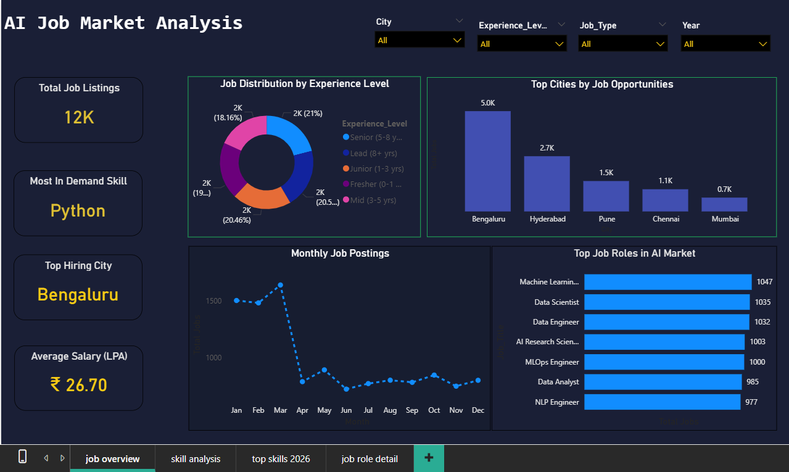
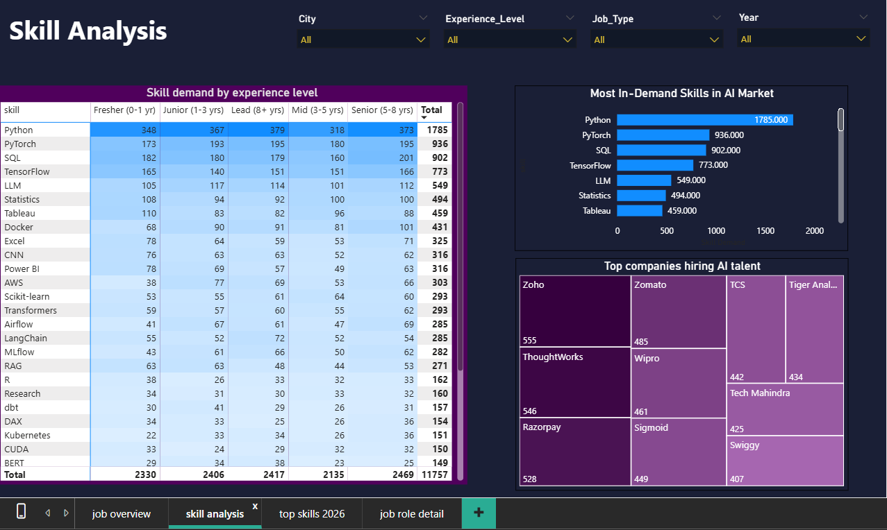
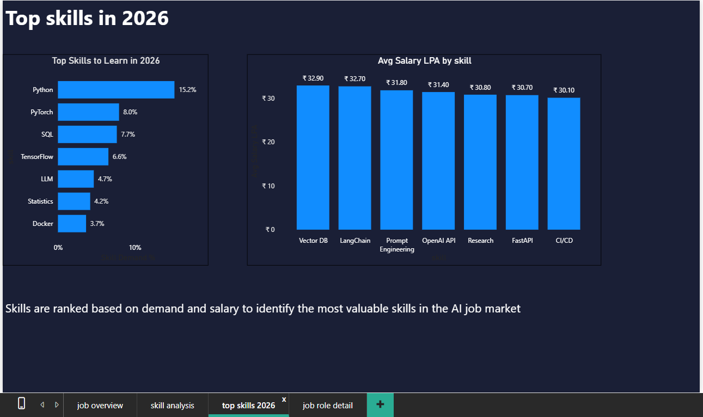
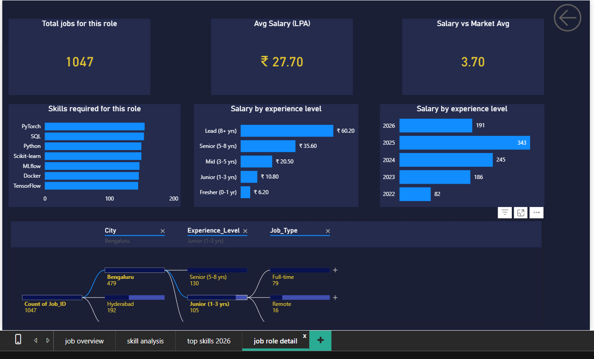

# 🤖 AI Job Market Analysis Dashboard | Power BI

This project focuses on building an interactive **AI Job Market Dashboard** using Power BI.
It involves the complete data analysis lifecycle — from data cleaning and transformation
to skill gap analysis and professional visualization.

---

## 📌 Project Workflow

**Data ➡️ Power Query ➡️ Data Modeling ➡️ DAX ➡️ Power BI Dashboard**

---

## 📊 Dataset Information

- **Total Records:** 12,000+ AI job postings
- **Columns:** 12
- **Period:** 2022 – 2026
- **Stored in:** CSV File

---

## 🔧 Steps Involved

### 1. Data Cleaning & Preparation

- Fixed column types — Salary to Number, Date_Posted to Date
- **Split** `Skills_Required` column by comma delimiter
- **Unpivoted** skill columns — each skill becomes its own row
- Created `Salary_Bucket` conditional column:
  - `Under 5L` / `5–10L` / `10–20L` / `20–40L` / `40L+`
- Removed duplicates and null values

### 2. Data Modeling

- Built **Star Schema** — Fact table + Date Table + Dim_Skill table
- Created table relationships — many to one
- Marked Date Table for time intelligence functions

### 3. DAX Measures Written

- `Total Jobs` — COUNTROWS
- `Avg Salary LPA` — AVERAGE divided by 100,000
- `Skill Demand %` — DIVIDE with CALCULATE and ALL
- `Salary Premium %` — VAR RETURN pattern vs market average
- `Top City` and `Top Skill` — FIRSTNONBLANK with TOPN

---

## 🔑 Key Insights

- **Python** appears in **15.2%** of all AI job postings
- **Machine Learning Engineer** has highest openings — **1,047 jobs** — peak in 2025
- **Bengaluru** leads with **42%** of all AI hiring
- **GenAI Engineer** pays **18% above** market average
- **Data Scientist** pays **3.4% below** market average — saturated role
- **Fresher ₹5.7L → Lead ₹58.1L** — 10x salary growth with experience
- **Zoho** is top hiring company with **555 openings**

---

## 📈 Dashboard Pages (Power BI)

1. Job Market Overview
2. Skill Analysis
3. Top Skills to Learn in 2026
4. Job Role Deep Dive *(Drillthrough)*

---

## 🚀 Tools & Technologies

- **Visualization:** Power BI
- **Data Cleaning:** Power Query
- **Calculations:** DAX
- **Data Model:** Star Schema
- **Dataset:** CSV File

---

## 🧠 Learnings

- Data wrangling using Power Query — split, unpivot, custom columns
- Star schema data modeling with fact and dimension tables
- Advanced DAX — CALCULATE, ALL, VAR RETURN, TOPN
- Drillthrough navigation between dashboard pages
- Decomposition Tree for interactive exploration
- Building multi-page dashboards for presentation

---

## ✅ Page 1: Job Market Overview

Overview of India's AI job market with KPI cards and trend visuals.

---

## ✅ Page 2: Skill Analysis

Skill demand by experience level, top companies and in-demand technologies.

---

## ✅ Page 3: Top Skills to Learn in 2026

Skills ranked by demand percentage and average salary premium.

---

## ✅ Page 4: Job Role Deep Dive *(Drillthrough)*

Right-click any role on Page 1 → Drillthrough → instant role-level analysis.
Shows required skills, salary by experience, peak year and city breakdown.

---

## 👤 Author

**Prashob KLR**
Aspiring Data Analyst | Power BI Developer

